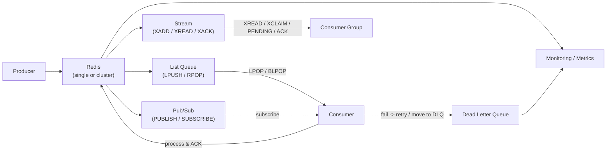

# Redis 如何实现消息队列

Redis 作为内存数据库，常被用作轻量级消息队列。常见实现方式有：

## 1. 基于 List 的队列

- **生产者** 使用 `LPUSH` 或 `RPUSH` 向队列插入消息。
- **消费者** 使用 `LPOP` 或 `RPOP` 取出消息，或用 `BLPOP`/`BRPOP` 阻塞式消费。

示例：

```shell
# 生产者推送消息
RPUSH queue_name "message1"
# 消费者消费消息
LPOP queue_name
```

## 2. 发布/订阅（Pub/Sub）

- 生产者通过 `PUBLISH` 发送消息到频道。
- 消费者通过 `SUBSCRIBE` 订阅频道，实时接收消息。

示例：

```shell
# 订阅
redis-cli SUBSCRIBE channel1
# 发布
redis-cli PUBLISH channel1 "hello"
```

> Pub/Sub 适合实时广播，消息不会持久化，订阅者离线会丢失消息。

## 3. Stream（流）

Redis 5.0+ 支持 Stream，适合更复杂的消息队列场景（如消费组、消息确认）。

示例：

```shell
# 生产者添加消息
XADD mystream * key1 value1
# 消费者读取消息
XREAD COUNT 1 STREAMS mystream 0
```

## 架构流程图

下面用 Mermaid 流程图描述常见的 Redis 作为消息队列时的架构与消息流向；你可以在 VS Code 中用已安装的 Markdown Preview Enhanced 或 Mermaid 插件预览。



说明要点：

- 生产者把消息写入 Redis 的三种常见方式：List（简单队列）、Stream（持久化、消费组、ACK）和 Pub/Sub（广播）。
- 消费者从 List 用 LPOP/BLPOP 拉取，从 Stream 用 XREAD / 消费组读取，并负责确认（ACK）或在失败时重试/移动到死信队列（DLQ）。
- Stream 提供更可靠的消息确认、Pending 列表和消费组特性，适合需要至少一次/精确一次语义的场景。
- 在生产环境中建议加上监控（延迟、队列长度、未确认消息数），以及持久化/备份策略来保证可恢复性。

## 总结

- 简单队列：用 List。
- 实时广播：用 Pub/Sub。
- 需要消息持久化、消费组等：用 Stream。

